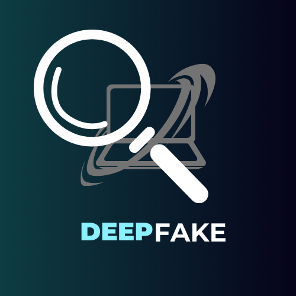

<p align="center">
  
</p>

# 🚀 Deepfake Detection Chrome Extension

🔍 Detect Deepfakes in Real-Time

This project is a **Chrome extension** designed to **scan webpages and detect deepfake media** using a **pretrained AI model**. Perfect for online security and misinformation detection!

---

## 📂 File Structure
```
DEEPFAKE_EXTENSION/
│── Extension/
│   ├── about.css
│   ├── about.html
│   ├── about.js
│   ├── background.js
│   ├── content.js
│   ├── dashboard.css
│   ├── dashboard.html
│   ├── dashboard.js
│   ├── history.css
│   ├── history.html
│   ├── history.js
│   ├── html2canvas.min.js
│   ├── manifest.json
│   ├── popup.css
│   ├── popup.html
│   ├── popup.js
│
│── Model/
│   ├── app.py  # Backend server to process deepfake detection
│   ├── audio-classifier.ipynb  # Notebook for AI-based audio deepfake detection
│
│── .gitignore
│── requirements.txt
```

---

## 🚀 Installation & Setup
### 1️⃣ Clone the Repository
```sh
git clone https://github.com/torichoudhury/Deepfake-Detection-Chrome-Extension.git

```
### 2️⃣ Install Dependencies
```sh
pip install -r requirements.txt
```
### 3️⃣ Load the Chrome Extension
1. Open **Google Chrome**
2. Navigate to `chrome://extensions/`
3. Enable **Developer Mode** (top right corner)
4. Click **Load Unpacked** and select the `Extension/` folder

---

## 🎯 Features
✅ **Scans Webpages in Real-Time**
✅ **Detects AI-Generated Fake Media** (Images, Audio, and Videos)
✅ **User-Friendly Dashboard**
✅ **Uses Advanced Deep Learning Models**

---

## 🎮 How to Use
1. Click on the extension icon in Chrome
2. The extension will **analyze media on the page**
3. If deepfake content is detected, you’ll get an **alert with details**
4. View history of scans in the **dashboard**

---

## 🤝 Contributing
We welcome contributions! Feel free to **submit pull requests** or **report issues**.

---

## 📜 License
This project is licensed under the **MIT License**. Feel free to use and modify it!

---

🔹 *Built for Hackathons & Ethical AI Development*

